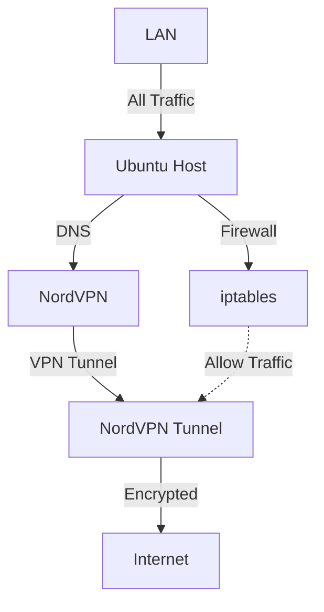

# 🛡️ NordVPN

## Use Case

Route all traffic through NordVPN on Ubuntu, with DNS leaks prevented and auto-reconnect enabled.

---

## 📊 Architecture Diagram

<div class="center-mermaid">

</div>

---

## 🧰 Prerequisites

- Ubuntu 20.04 or later (Desktop or Server)
- Active NordVPN subscription
- Administrative sudo access
- Network not restricted by corporate firewalls that block VPNs

---

## 🧪 Step-by-Step Setup Instructions

### 1. 🔧 Install NordVPN CLI

```bash
sh <(curl -sSf https://downloads.nordcdn.com/apps/linux/install.sh)
```

This script handles:

- Adding NordVPN repo
- Installing `nordvpn` CLI
- Setting up required services

---

### 2. ✅ Login to NordVPN

```bash
nordvpn login
```

- It will open a browser window to authenticate.
- Once successful, it stores your token for future sessions.

---

### 3. ⚙️ Set Auto-Connect & CyberSec

```bash
nordvpn set autoconnect on
nordvpn set cybersec on
nordvpn set killswitch on
nordvpn set notify off
nordvpn set technology nordlynx
nordvpn set protocol udp
```

---

### 4. 🔐 Connect to VPN

```bash
nordvpn connect
```

Optional:

```bash
nordvpn connect us
nordvpn connect uk
```

---

### 5. 🛡️ Prevent DNS Leaks

```bash
nordvpn set dns 103.86.96.100 103.86.99.100
```

---

### 6. 🔁 Enable Auto-Reconnect on Boot

```bash
crontab -e
```

Add:

```cron
@reboot nordvpn connect
```

---

### 7. 🔥 Configure Firewall Rules (Optional)

```bash
sudo iptables -P OUTPUT DROP
sudo iptables -A OUTPUT -o tun0 -j ACCEPT
sudo iptables -A OUTPUT -o lo -j ACCEPT
sudo iptables -A OUTPUT -p udp --dport 53 -j ACCEPT
sudo iptables -A OUTPUT -p udp --dport 1194 -j ACCEPT
sudo iptables-save > /etc/iptables/rules.v4
```

---

## 🧪 Verify

```bash
curl ifconfig.io
nordvpn status
dig google.com
```

---

## 🔄 To Disconnect

```bash
nordvpn disconnect
```

[Back to Top](nordvpn.md)