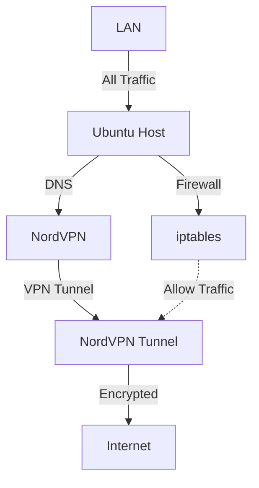

# 🛡️ NordVPN

## Use Case

Route all traffic through NordVPN on Ubuntu, with DNS leaks prevented and auto-reconnect enabled.

---

## 📊 Architecture Diagram

<div class="center-mermaid">

</div>

---

## 🧰 Prerequisites

- Ubuntu 20.04 or later (Desktop or Server)
- Active NordVPN subscription
- Administrative sudo access
- Network not restricted by corporate firewalls that block VPNs

---

## 🧪 Step-by-Step Setup Instructions

### 1. 🔧 Install NordVPN CLI

```bash
sh <(curl -sSf https://downloads.nordcdn.com/apps/linux/install.sh)
```

This script handles:

- Adding NordVPN repo
- Installing `nordvpn` CLI
- Setting up required services

---

### 2. ✅ Login to NordVPN


#### Login to your NordVPN account (headless/remote-friendly):

1. On your Ubuntu machine, run:
   ```bash
   nordvpn login
   ```
   - This will print a URL in the terminal (e.g., https://nordvpn.com/sso/?code=...)

2. Copy the URL and open it in a browser on any device.
   - Log in with your NordVPN credentials.

3. After login, you will see a "Continue" button. **Right-click** on it and copy the link address (the callback URL).

4. Go back to your Ubuntu machine and run:
   ```bash
   nordvpn login --callback "<Paste-the-callback-URL-here>"
   ```
   - Replace `<Paste-the-callback-URL-here>` with the URL you copied in step 3.

This method works for headless servers and remote SSH sessions.

---

### 3. ⚙️ Set Auto-Connect & CyberSec


```bash
# Core connection settings
nordvpn set technology nordlynx
nordvpn set protocol udp
nordvpn set autoconnect on
nordvpn set firewall off
nordvpn set firewall-mark 0xe1f1
nordvpn set routing on
nordvpn set analytics off
nordvpn set killswitch on
nordvpn set threatprotectionlite off
nordvpn set notify off
nordvpn set tray off
nordvpn set ipv6 off
nordvpn set meshnet off
nordvpn set landiscovery on
nordvpn set virtuallocation on
nordvpn set postquantum off
```

---

### 4. � Enable IP Forwarding (for LAN access)

```bash
sudo sysctl -w net.ipv4.ip_forward=1
echo "net.ipv4.ip_forward=1" | sudo tee -a /etc/sysctl.conf
```

---

### 5. � Connect to VPN

```bash
nordvpn connect
```

Optional:

```bash
nordvpn connect us
nordvpn connect uk
```

---

### 6. 📜 Routing Table & Custom Routes (LAN reachability)

After connecting to NordVPN, your routing table should look like this:

```text
default via 192.168.1.1 dev enp2s0           # original LAN gateway
10.5.0.0/16 dev nordlynx proto kernel        # NordVPN tunnel
default via 10.5.0.1 dev nordlynx            # NEW default gateway
192.168.1.0/24 dev enp2s0 scope link         # keep LAN reachable
```

To enforce these routes:

```bash
sudo ip route replace default via 10.5.0.1 dev nordlynx
sudo ip route add 192.168.1.0/24 dev enp2s0
```

---

### 7. 🔥 NAT & MASQUERADE with iptables

```bash
# Flush old rules
sudo iptables -t nat -F
sudo iptables -F

# Masquerade all outbound traffic via VPN
sudo iptables -t nat -A POSTROUTING -o nordlynx -j MASQUERADE

# Allow LAN
sudo iptables -A INPUT -i enp2s0 -s 192.168.1.0/24 -j ACCEPT
sudo iptables -A FORWARD -i enp2s0 -o nordlynx -j ACCEPT
sudo iptables -A FORWARD -i nordlynx -o enp2s0 -m state --state RELATED,ESTABLISHED -j ACCEPT
```

---

### 8. 🛡️ Prevent DNS Leaks

By default, NordVPN uses its own DNS servers. For most users, this is sufficient to prevent DNS leaks. If you want to use a custom DNS (such as a local Pi-hole or dnscrypt-proxy), see the next section.

---

### 9. 🧩 Additional: Using Local DNS (Pi-hole, dnscrypt-proxy, etc.)

If you want all DNS queries to go through a local resolver (e.g., Pi-hole running on the same machine or LAN):

```bash
nordvpn set dns 127.0.0.1 127.0.0.1
```

To ensure DNS requests are routed locally and not through the VPN tunnel:

```bash
# Make sure DNS requests to 127.0.0.1 (dnscrypt-proxy) go local
sudo ip rule add from 127.0.0.1 lookup main
sudo ip rule add to 127.0.0.1 lookup main

# Or for a specific DNS server IP (e.g., 192.168.1.2):
sudo ip rule add to 192.168.1.2 table main
```

This setup is recommended if you want to use local DNS filtering or logging, or if you run a DNS server on your LAN.

---

### 10. 🧱 Firewall Rules for DNS on LAN

Allow DNS requests from your LAN subnet:

```bash
sudo iptables -A INPUT -p udp --dport 53 -s 192.168.1.0/24 -j ACCEPT
sudo iptables -A INPUT -p tcp --dport 53 -s 192.168.1.0/24 -j ACCEPT
```

---

### 11. 🔁 Enable Auto-Reconnect on Boot

```bash
crontab -e
```

Add:

```cron
@reboot nordvpn connect
```

---

### 12. 🔥 (Optional) Extra Firewall Lockdown

```bash
sudo iptables -P OUTPUT DROP
sudo iptables -A OUTPUT -o tun0 -j ACCEPT
sudo iptables -A OUTPUT -o lo -j ACCEPT
sudo iptables -A OUTPUT -p udp --dport 53 -j ACCEPT
sudo iptables -A OUTPUT -p udp --dport 1194 -j ACCEPT
sudo iptables-save > /etc/iptables/rules.v4
```

---

## 🧪 Verify

```bash
curl ifconfig.io
nordvpn status
dig google.com
```

---

## 🔄 To Disconnect

```bash
nordvpn disconnect
```

---

[Back to Top](nordvpn.md)