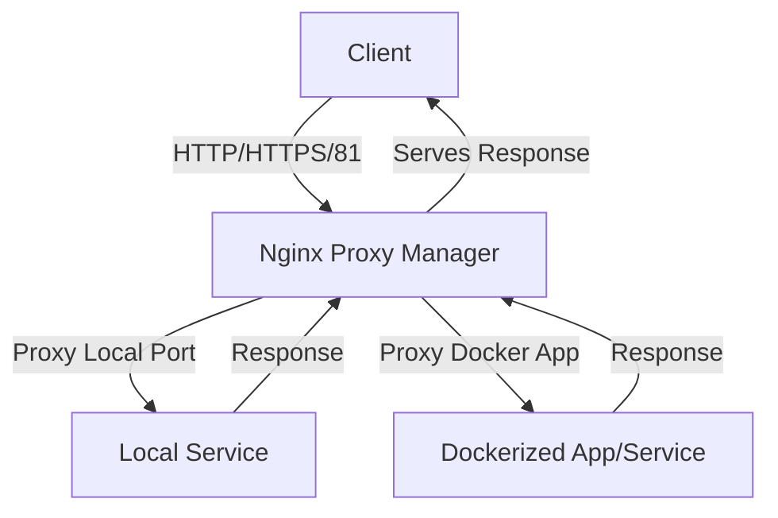

# 🧭 Nginx Proxy Manager

## Use Case

Easily manage reverse proxy rules, SSL certificates, and secure access for self-hosted web applications and services. Nginx Proxy Manager provides a user-friendly web UI to route traffic to apps running on your server or Docker, automate Let's Encrypt SSL, and simplify exposing services to the internet or your local network.

## 🗂️ Project Architecture



---

## 🔧 1. Prerequisites

### 🖥️ Server Requirements

- A **Linux server** (VPS, dedicated, or home server) with root access  
- At least **512MB RAM** (1GB+ recommended)  
- **Ports 80 (HTTP), 443 (HTTPS), and 81 (Admin)** must be open

> Port 81 is used for the NPM web UI.

### 🧱 Required Software

Install Docker:

```bash
curl -fsSL https://get.docker.com -o get-docker.sh
sudo sh get-docker.sh
```

Install Docker Compose v2:

```bash
sudo apt install docker-compose-plugin
```

Verify installation:

```bash
docker -v
docker compose version
```

### 🌐 Optional: Domain Name

You can use either:

- A **domain** (e.g. `app.example.com`) for public services
- Just your **server’s IP address** for internal/private access

### 🔐 Optional: Custom SSL Certificates

- `.crt` file (certificate)
- `.key` file (private key)
- Must be in PEM format

---

## 🗂️ 2. Project Structure

```bash
/srv/proxy/
├── docker-compose.yml
├── data/              # NPM internal data & DB
└── letsencrypt/       # Cert storage (Let's Encrypt & custom)
```

| Host Path              | Container Path            | Purpose                        |
|-----------------------|---------------------------|--------------------------------|
| `/srv/proxy/data`     | `/data`                   | NPM config, UI, DB             |
| `/srv/proxy/letsencrypt` | `/etc/letsencrypt`     | SSL certs                      |

Use a Docker network:

```yaml
networks:
  proxy-net:
    name: proxy-net
```

---

## ⚙️ 3. Docker Compose Configuration

```yaml
x-commonKeys: &commonOptions
  restart: always
  stdin_open: true
  tty: true

x-dnsServers: &dnsServers
  dns:
    - 1.1.1.1
    - 9.9.9.9

x-defaultEnvironment: &defaultEnvironment
  UMASK: 002
  TZ: UTC

networks:
  proxy-net:
    name: proxy-net

services:
  proxy:
    container_name: proxy
    image: jc21/nginx-proxy-manager:latest
    environment:
      <<: *defaultEnvironment
    volumes:
      - /srv/proxy/data:/data
      - /srv/proxy/letsencrypt:/etc/letsencrypt
    ports:
      - 80:80
      - 81:81
      - 443:443
    networks:
      - proxy-net
    cap_add:
      - NET_ADMIN
    healthcheck:
      test: ["CMD", "/usr/bin/check-health"]
      interval: 60s
      timeout: 30s
      retries: 5
    <<: [*dnsServers, *commonOptions]
```

Start with:

```bash
cd /srv/proxy
docker compose up -d
```

---

## 🚀 4. Accessing NPM

Visit `http://<your-server-ip>:81` in your browser.  

Login with default credentials:

- **Email:** `admin@example.com`
- **Password:** `changeme`

You’ll be prompted to change them.

---

## 🔧 5. Initial Configuration

- Go to **Dashboard**
- Click **Proxy Hosts → Add Proxy Host**
- Enter domain or IP (e.g., `192.168.1.100`)
- Set forward hostname/IP and port
- Enable **Websockets Support** if needed
- Save

---

## 🔒 6. SSL Setup Options

### ✅ Let’s Encrypt

- Open the **SSL tab**
- Select **Request a new SSL certificate**
- Agree to terms
- Enable **Force SSL** and **HTTP/2**
- Make sure DNS A record points to your server

### 🔐 Custom SSL

- Go to **SSL → Custom**
- Upload `.crt` and `.key` files
- Assign the cert when configuring proxy host

---

## 🧪 7. Testing and Troubleshooting

### Test:

- Open domain/IP in browser
- Use:

```bash
curl -I https://your-domain.com
```

### Logs:

```bash
docker logs proxy
```

### Common issues:

| Problem             | Solution                          |
|---------------------|-----------------------------------|
| Cert request fails  | Open port 80 and verify DNS       |
| 502 Bad Gateway     | Target container may not be up    |
| Container unhealthy | Check volumes and permissions     |

---

## 🛡️ 8. Hardening & Tips

- 🔐 Restrict UI (port 81) with firewall or Access List
- 🛡️ Use Cloudflare Tunnel or Tailscale
- 💾 Backup `/srv/proxy`
- 🌀 Use `restart: always` in Compose

---

## 📦 9. Updating

To update NPM:

```bash
docker compose pull
docker compose down
docker compose up -d
```

This retains data and certs.

---

## 📄 10. Appendix

### Default Credentials

- Email: `admin@example.com`
- Password: `changeme`

### Let’s Encrypt Limits (2025)

- 50 certificates/domain/week
- 5 identical certs/week

### Useful Docker Commands

```bash
docker ps
docker logs proxy
docker compose up -d
docker compose down
```

[Back to Top](npm.md)