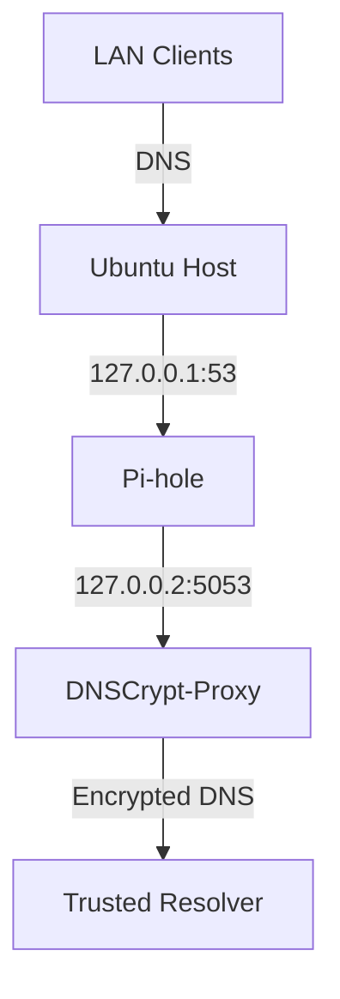

# 🧅 Pi-Hole & DNSCrypt-Proxy

## Use Case

Run **Pi-hole** for ad/tracker blocking and **DNSCrypt-Proxy** for secure DNS resolution on the same Ubuntu host. This setup works alongside a full-tunnel NordVPN connection, ensuring **local DNS filtering** without DNS leaks.

---

## 📊 Architecture Diagram

<div class="center-mermaid">

</div>

---

## 🧰 Prerequisites

- Ubuntu 20.04+ with NordVPN configured
- Static IP or DHCP reservation on LAN
- `systemd-resolved` disabled (or reconfigured)
- Port 53 open locally
- Familiarity with basic shell/iptables tasks

---

## 🧪 Step-by-Step Setup Instructions

### 1. ⛔ Disable systemd-resolved (if running)

```bash
sudo systemctl stop systemd-resolved
sudo systemctl disable systemd-resolved
sudo rm /etc/resolv.conf
echo "nameserver 127.0.0.1" | sudo tee /etc/resolv.conf
```

---

### 2. 🍩 Install Pi-hole

```bash
curl -sSL https://install.pi-hole.net | bash
```

During install:

- Choose **static IP** (e.g., `192.168.1.100`)
- Choose **custom upstream DNS** → use `127.0.0.2#5053` (for DNSCrypt)
- Interface: your LAN interface (e.g., `enp2s0`)
- Do NOT enable DHCP (unless you're replacing your router's DHCP)

---

### 3. 🔐 Install DNSCrypt-Proxy

```bash
sudo apt install -y dnscrypt-proxy
```

Edit the config:

```bash
sudo nano /etc/dnscrypt-proxy/dnscrypt-proxy.toml
```

Set:

```toml
listen_addresses = ['127.0.0.2:5053']
server_names = ['cloudflare', 'nextdns', 'quad9-dnscrypt-ipv4']
```

Restart:

```bash
sudo systemctl restart dnscrypt-proxy
```

---

### 4. 🔁 Point Pi-hole to DNSCrypt

Edit:

```bash
sudo nano /etc/pihole/setupVars.conf
```

Set:

```bash
PIHOLE_DNS_1=127.0.0.2#5053
```

Then:

```bash
pihole restartdns
```

---

### 5. 🔥 Allow DNS on Firewall

```bash
sudo iptables -A INPUT -p udp --dport 53 -s 192.168.1.0/24 -j ACCEPT
sudo iptables -A INPUT -p tcp --dport 53 -s 192.168.1.0/24 -j ACCEPT
```

---

### 6. 🧲 Redirect All LAN DNS to Pi-hole (Optional)

```bash
sudo iptables -t nat -A PREROUTING -i enp2s0 -p udp --dport 53 -j DNAT --to-destination 192.168.1.100:53
sudo iptables -t nat -A PREROUTING -i enp2s0 -p tcp --dport 53 -j DNAT --to-destination 192.168.1.100:53
```

---

### 7. 🧪 Verify DNS Flow

```bash
dig @127.0.0.1 google.com
dig @127.0.0.2 google.com
```

---

### 8. 💾 Auto-start on Boot

```bash
sudo systemctl enable pihole-FTL
sudo systemctl enable dnscrypt-proxy
```

---

## 🧩 Integration with NordVPN

```bash
nordvpn set dns 127.0.0.1 127.0.0.1
sudo ip rule add from 127.0.0.1 lookup main
sudo ip rule add to 127.0.0.1 lookup main
sudo ip rule add to 127.0.0.2 lookup main
```

---

## 🔄 Restart DNS Stack

```bash
sudo systemctl restart dnscrypt-proxy
pihole restartdns
```

---

## 🔒 Optional: Add DNSCrypt Filters

```toml
require_nolog = true
require_nofilter = true
ipv6_servers = false
```

---

## 🧼 To Uninstall

```bash
sudo pihole uninstall
sudo apt purge dnscrypt-proxy
```

---

## ✅ Done!

You now have secure, private DNS with ad/tracker blocking over VPN.

[Back to Top](pi-hole-dnscrypt-proxy.md)